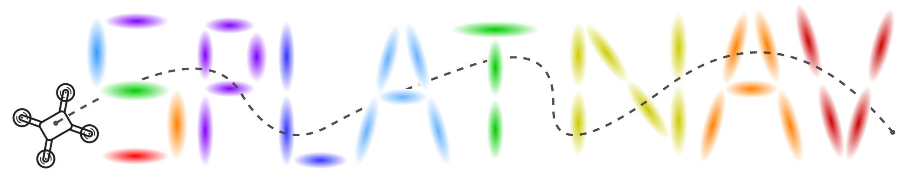

<p align="center">

  <h1 align="center"></h1>
  <h2 align="center">Safe Real-Time Robot Navigation in
Gaussian Splatting Maps</h2>
  <p align="center"> 
    <a href="https://msl.stanford.edu/people/timchen"><strong>Timothy Chen</strong><sup>1</sup></a>
    ·
    <a href="https://msl.stanford.edu/people/olashorinwa"><strong>Ola Shorinwa</strong><sup>1</sup></a>
    ·
    <a href="https://www.joseph-bruno.com/"><strong>Joseph Bruno</strong><sup>3</sup></a>
    ·
    <a href="https://aidenswann.com/"><strong>Aiden Swann</strong><sup>1</sup></a>
    ·
    <a href="https://msl.stanford.edu/people/javieryu"><strong>Javier Yu</strong><sup>1</sup></a>
    ·
    <a href="https://x.com/WeijiaZeng1"><strong>Weijia Zeng</strong><sup>2</sup></a>
    ·
    <a href="https://msl.stanford.edu/people/keikonagami"><strong>Keiko Nagami</strong><sup>1</sup></a>
    ·
    <a href="https://engineering.temple.edu/directory/philip-dames-tug85627"><strong>Philip Dames</strong><sup>3</sup></a>
    ·
    <a href="https://web.stanford.edu/~schwager/"><strong>Mac Schwager</strong><sup>1</sup></a>
  </p>
  <p align="center"><strong><sup>1</sup>Stanford University</strong></p>
  <p align="center"><strong><sup>2</sup>UC San Diego</strong></p>
  <p align="center"><strong><sup>3</sup>Temple University</strong></p>
  <!-- <h2 align="center">Submitted TR-O 2025</h2> -->
  <h3 align="center"><a href="https://chengine.github.io/splatnav"> Project Page</a> | <a href= "https://arxiv.org/abs/2403.02751">arXiv</a> | <a href="https://drive.google.com/drive/folders/1K0zfpuAti43YIBK5APFd-Yv73CvljgMC?usp=sharing">Data</a></h3>
  <div align="center"></div>
</p>
<p align="center">
  <a href="">
    <!--  -->
  </a>
</p>
<h3 align="center">
Splat-Nav is a real-time navigation pipeline designed to work with environment representations generated by Gaussian Splatting (GSplat), a powerful new 3D scene representation. 
Splat-Nav consists of two components: Splat-Plan, a safe planning module, and Splat-Loc, a robust pose estimation module.
</h3>

## About
Splat-Plan builds a safe-by-construction polytope corridor through the map based on mathematically rigorous collision constraints and then constructs a Bezier curve trajectory through this corridor. Splat-Loc provides a robust state estimation module, leveraging the point-cloud representation inherent in GSplat scenes for recursive real-time pose localization, given only RGB images. The most compute-intensive procedures in our navigation pipeline, such as the computation of the Bezier trajectories and the pose optimization problem run primarily on the CPU, freeing up GPU resources for GPU-intensive tasks, such as online training of Gaussian Splats. We demonstrate the safety and robustness of our pipeline in both simulation and hardware experiments, where we show online re-planning at greater than 5 Hz and pose estimation at about 25 Hz, an order of magnitude faster than Neural Radiance Field (NeRF)-based navigation methods, thereby enabling real-time navigation. 

## Features
1. Our ROS nodes for Splat-Plan and Splat-Loc can now be found in the `ros` branch of this repository.
2. Splat-Nav supports semantic goal querying. While in practice, Splat-Nav can use any semantic GSplats to query a goal, our results run on an in-house semantic GSplat model, which can be found in the `semantics` branch of this repository.

## Dependencies
This repository is built off of [Nerfstudio](https://github.com/nerfstudio-project/nerfstudio/tree/main). Please first follow the installation instructions there before installing any of the dependencies specifically for this repository. Once you have Nerfstudio installed in your Conda environment, install the following dependencies in that environment.

* [Clarabel](https://github.com/oxfordcontrol/Clarabel.rs). This library is for solving the quadratic program.
* [dijkstra3d](https://github.com/seung-lab/dijkstra3d). This library is for solving A* for path initialization.
* [polytope](https://github.com/tulip-control/polytope/tree/main). This library is for performing certain operations with polytopes.
* [cvxopt](https://cvxopt.org/). Generic convex solver.
* [cvxpy](https://www.cvxpy.org/). Generic convex solver.
* [unfoldNd](https://github.com/f-dangel/unfoldNd). Necessary to perform Maxpool3D operation over masked kernel for producing voxel grid.
* [LightGlue](https://github.com/cvg/LightGlue). Feature matching for Splat-Loc.
* [viser](https://github.com/nerfstudio-project/viser). Web-based 3D interactive visualizer. This already comes with Nerfstudio, however the latest version is needed to render Gaussian Splats.

## Datasets
Our datasets, trained models, and trajectories are hosted on a [Google Drive](https://drive.google.com/drive/folders/1K0zfpuAti43YIBK5APFd-Yv73CvljgMC?usp=sharing). The scenes used in the paper are `flightgate` (`flight`), `statues`,  `stonehenge`, `adirondacks` (which is also named `old union`). The training data and model is in the `training` folder, while the trajectories are in `traj` (simulated) and `ros` (hardware). You can drag and drop these folders into your working directory.

Here's an example:
```
Splat-Nav
├── data                                                                                                       
│   └── flight
│       └── images
│       └── transforms.json                                                                                  
│                                                                                               
├──outputs                                                                                                                                                      
│   └── flight                                                                                                  
│       └── splatfacto                                                                                                                             
│           └── 2024-09-12_172434                                                                               
│               └── nerfstudio_models
|               └── config.yml
|               └── dataparser_transforms.json # This file contains the transform that transforms from "Data" frame to "Nerfstudio" frame (which is typically a unit box)
├── run.py
```

## Running Splat-Nav

### Splat-Plan
After the dependencies, data, and model is set up, run
```
python run_splatplan.py
```
to execute Splat-Plan on simulated scenes. The most important thing is to ensure that the path in GSplatLoader is pointing to the right model location. Many parameters can be tuned in this file. The trajectory data will be saved in the `trajs` folder.

#### Baselines
Within `run.py`, there is also the option to run our Python implementation of the Safe Flight Corridor baseline (https://ieeexplore.ieee.org/document/7839930). The RRT* baseline can be executed through `run_rrt.py`.

### Splat-Loc
Similarly, run
```
python run_splatloc.py
```
to execute Splat-Loc on specified trained models and datasets. 

### Visualizing the paths
Data visualization is done through viser (https://github.com/nerfstudio-project/viser). It is a web-based 3D interactive visualizer that supports meshes and Gaussian Splatting. Viser also supports programmatic view rendering, which was used to generate many of the visuals in our videos. To visualize the trajectories in viser, run
```
python visualize.py
```
. The latest version of viser should be used, as that supports Gaussian Splatting rendering.

## Generating your own scenes
To use your own datasets, simply train a Nerfstudio `splatfacto` model and follow the folder structure as illustrated above. We also provide a simple way of producing sparse reconstructions of the scene by including a simple L1 sparsity loss on the opacity during Gaussian Splatting training (https://github.com/chengine/sparse_splat). These sparser models are also provided in the Google Drive. In `run.py`, there is a flag to use the sparser model. 

## Citation
If you found Splat-Nav useful, consider citing us! Thanks!
```
@misc{chen2024splatnav,
      title={Splat-Nav: Safe Real-Time Robot Navigation in Gaussian Splatting Maps}, 
      author={Timothy Chen and Ola Shorinwa and Joseph Bruno and Javier Yu and Weijia Zeng and Aiden Swann and Keiko Nagami and Philip Dames and Mac Schwager},
      year={2024},
      eprint={2403.02751},
      archivePrefix={arXiv},
      primaryClass={cs.RO},
      url={https://arxiv.org/abs/2403.02751}, 
}
```
